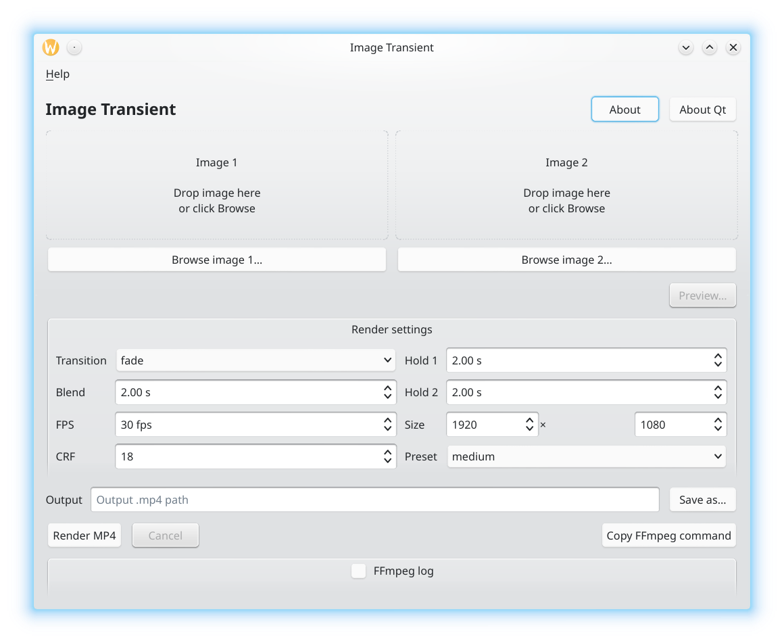

# Image Transient



Image Transient is a compact Qt 6 Widgets desktop app that creates a short MP4 transition video from two still images.

## Features

- Compact main window
- Drag-and-drop or browse for two images
- Preview button with a modal picture box and blend slider
- Export MP4/H.264 video through FFmpeg
- Choose FFmpeg `xfade` transition type
- Set first-image hold, transition duration and second-image hold
- Set output resolution, FPS, CRF quality and encoder preset
- Copy the generated FFmpeg command
- Linux `.desktop` launcher and icon
- AUR helper for Archlinux users.

## License

Image Transient is licensed under `GPL-3.0-or-later`.

Qt is used through the normal Qt open-source model. The program links to Qt 6 Widgets dynamically on Linux distribution packages.

## Runtime dependency

FFmpeg must be installed and available in `PATH`.

## Supported input images

PNG, JPEG, WebP, BMP, TIFF and any other image format your FFmpeg build can decode.

## Quick install from source

The root installer auto-detects common Linux distributions:

```bash
chmod +x install.sh scripts/*.sh
./install.sh
```

Then launch **Image Transient** from the KDE application launcher, or run:

```bash
imagetransient
```

## Arch Linux / Manjaro / EndeavourOS

Build only:

```bash
sudo pacman -S --needed base-devel cmake ninja qt6-base ffmpeg
./scripts/build-linux.sh
./build/release/imagetransient
```

Install:

```bash
./scripts/install-arch.sh
```

Legacy wrapper kept for convenience:

```bash
./build-arch.sh
```

## Debian / Ubuntu / Linux Mint / Pop!_OS

```bash
./scripts/install-debian-ubuntu.sh
```

The script installs:

```bash
build-essential cmake ninja-build qt6-base-dev ffmpeg
```

## Fedora / RHEL / Rocky / AlmaLinux

```bash
./scripts/install-fedora.sh
```

The script installs the compiler, CMake, Ninja, Qt 6 development packages and FFmpeg using `dnf`.

On some Fedora/RHEL-like systems, FFmpeg may require extra multimedia repositories such as RPM Fusion. Enable those repositories first if `dnf install ffmpeg` cannot find FFmpeg.

## openSUSE Leap / Tumbleweed

```bash
./scripts/install-opensuse.sh
```

The script installs the C++ development pattern, CMake, Ninja, Qt 6 development packages and FFmpeg.

## Alpine Linux

```bash
./scripts/install-alpine.sh
```

The script installs:

```bash
build-base cmake ninja qt6-qtbase-dev ffmpeg
```

## Generic Linux build without installing dependencies

Install these dependencies with your package manager:

- C++17 compiler
- CMake 3.20+
- Ninja
- Qt 6 Widgets development package
- FFmpeg runtime

Then build:

```bash
./scripts/build-linux.sh
./build/release/imagetransient
```

Manual CMake build:

```bash
cmake -S . -B build/release -G Ninja -DCMAKE_BUILD_TYPE=Release -DCMAKE_INSTALL_PREFIX=/usr/local
cmake --build build/release --parallel
sudo cmake --install build/release
```

Useful overrides:

```bash
BUILD_DIR=build/debug BUILD_TYPE=Debug ./scripts/build-linux.sh
PREFIX=/usr/local ./scripts/install-arch.sh
```

## How preview works

The preview window loads both source images into a modal dialog. The slider ranges from 0 to 100:

- Far left: the picture box shows picture 1.
- Middle: the picture box shows an even blend of picture 1 and picture 2.
- Far right: the picture box shows picture 2.

This preview is a fast Qt image blend. The final video render still uses FFmpeg `xfade`.

## How rendering works

The app builds an FFmpeg command using the `xfade` filter. Both input images are normalized to the selected output size, frame rate, pixel format, sample aspect ratio and time base before the transition is applied.

Example command shape:

```bash
ffmpeg -loop 1 -i image1.png -loop 1 -i image2.png \
  -filter_complex "[0:v]scale=1920:1080:force_original_aspect_ratio=decrease,pad=1920:1080:(ow-iw)/2:(oh-ih)/2,setsar=1,fps=30,format=rgba,trim=duration=4,setpts=PTS-STARTPTS[v0];[1:v]scale=1920:1080:force_original_aspect_ratio=decrease,pad=1920:1080:(ow-iw)/2:(oh-ih)/2,setsar=1,fps=30,format=rgba,trim=duration=4,setpts=PTS-STARTPTS[v1];[v0][v1]xfade=transition=fade:duration=2:offset=2,format=yuv420p[v]" \
  -map "[v]" -t 6 -an -c:v libx264 -preset medium -crf 18 -movflags +faststart output.mp4
```

## Notes

- If FFmpeg fails with an unsupported transition name, choose `fade` first, then test other transitions.
- Lower CRF means higher quality and bigger files. CRF 18 is a good high-quality default.
- 1920×1080 at 30 FPS is a good default for normal videos.
